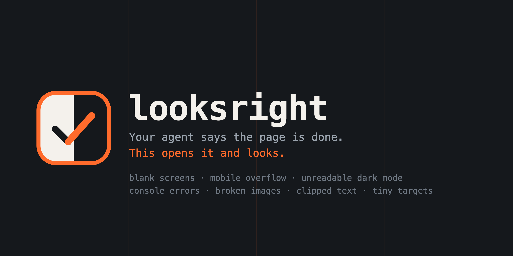

<p align="center"></p>

<p align="center"><em>Your agent says the page is done. LooksRight opens it and looks.</em></p>

<p align="center">
  
  
  
</p>

---

An agent finishes a screen and reports it done. The build passes, the types check, the unit tests are green. You open it on your phone and the page is blank, or the price is invisible in dark mode, or the whole layout slides sideways under your thumb. None of those failures throw. None of them have a stack trace. Nothing in a type checker or a test runner has ever looked at a pixel.

LooksRight closes that gap the boring way: it opens the page in a real Chrome, once for every combination of route, viewport and theme, and runs 12 deterministic checks against the rendered DOM. No baseline images, no snapshots to approve, no service to sign up for. Each finding names the element and the number behind the claim, so it points at a line to go fix instead of a screenshot to squint at.

It exits 1 when it finds an error, which is the entire CI integration. Drop the command in a workflow after your app starts and the build fails when the screen is broken.

```
0  no error level finding survived
1  at least one error level finding
2  looksright could not run: no browser, bad config, bad flag, bad usage
```

## Quickstart

```bash
npx looksright check http://localhost:3000
```

That visits `/` at phone, tablet and desktop, in light and dark: six scenes, no config file.

```
✗ / phone light (2103ms)
✗ / phone dark (2246ms)
! / tablet light (1834ms)
✗ / tablet dark (1902ms)
✓ / desktop light (1751ms)
✗ / desktop dark (1798ms)

✗ / · phone · light  http://localhost:3000/
  error Horizontal overflow  The page scrolls sideways on phone: the document is 640px wide inside a 390px viewport, 250px too wide.
  error Horizontal overflow  table.pricing-grid is 640px wide and runs 250px past the right edge of the 390px viewport.
        table.pricing-grid
  warn  Touch target size  The "Remove" button is 28x28 px, under the 44x44 px touch target size recommended for phones (it does clear the 24x24 px WCAG minimum).
        button.remove

✗ / · phone · dark  http://localhost:3000/
  error Horizontal overflow  The page scrolls sideways on phone: the document is 640px wide inside a 390px viewport, 250px too wide.
  error Horizontal overflow  table.pricing-grid is 640px wide and runs 250px past the right edge of the 390px viewport.
        table.pricing-grid
  error Invisible text  Text is invisible in dark mode: '$1,280.00' is #111827 on a #111827 background (1:1).
        div.card > span.price
  warn  Touch target size  The "Remove" button is 28x28 px, under the 44x44 px touch target size recommended for phones (it does clear the 24x24 px WCAG minimum).
        button.remove

! / · tablet · light  http://localhost:3000/
  warn  Clipped text  74px of text is cut off past the right edge of a.nav-item with nothing to signal it, because it sets white-space:nowrap and overflow:hidden without text-overflow:ellipsis, starting at "ttings".
        a.nav-item

✗ / · tablet · dark  http://localhost:3000/
  error Invisible text  Text is invisible in dark mode: '$1,280.00' is #111827 on a #111827 background (1:1).
        div.card > span.price
  warn  Clipped text  74px of text is cut off past the right edge of a.nav-item with nothing to signal it, because it sets white-space:nowrap and overflow:hidden without text-overflow:ellipsis, starting at "ttings".
        a.nav-item

✗ / · desktop · dark  http://localhost:3000/
  error Invisible text  Text is invisible in dark mode: '$1,280.00' is #111827 on a #111827 background (1:1).
        div.card > span.price

Does not look right. 7 errors and 4 warnings across 5 of 6 scenes, 1 clean.
```

Three bugs, found in twelve seconds, each one named with the element that causes it. The dark theme bug never showed up in light mode. The overflow never showed up on desktop. That is why the tool runs the same page more than once.

More ways to call it:

```bash
npx looksright check / --viewport phone --theme dark   # relative path, resolved against baseUrl in the config
npx looksright check https://example.com --shots .looksright --md report.md
npx looksright init      # writes an example looksright.config.json
npx looksright checks    # lists the checks and their default level
```

## What it checks

| id | level | catches |
|---|---|---|
| `blank-page` | error | the page rendered nothing, or every element with content hit tests as clipped away |
| `console-errors` | error | an exception thrown during load (messages that only echo a failed request are dropped) |
| `failed-requests` | error | 4xx, 5xx and network failures, grouped by host, favicon demoted to warn |
| `stuck-loading` | error | a spinner or skeleton still on screen 1200ms later, confirmed by reading twice |
| `horizontal-overflow` | error | the page scrolls sideways on a phone, naming the element that does it, plus a missing `<meta viewport>` |
| `clipped-text` | warn | text cut off by its container with no ellipsis to signal it |
| `invisible-text` | error | text nearly the same color as its own background (ratio under 1.35), the half-finished theme bug |
| `leaked-markup` | error | markup printed as text: `*bold*`, `**bold**`, `[link](url)`, `<br>`, `&amp;`, `{{placeholder}}`, a stray `undefined` |
| `contrast` | warn | WCAG AA contrast failures measured on the text actually painted |
| `broken-images` | error | an `` that did not load, a web font the browser gave up on |
| `tiny-targets` | warn | touch targets under 24px (error) or 44px (warn), on phone viewports only |
| `missing-labels` | warn | icon button with no accessible name, field with no label, img with no alt, iframe with no title |

Every check documents what it deliberately stays quiet about. The long version lives in [docs/checks.md](docs/checks.md).

## Install

Nothing to install, if you only want to run it:

```bash
npx looksright check http://localhost:3000
```

As a dev dependency, so CI pins a version:

```bash
npm install --save-dev looksright
```

```json
{
  "scripts": {
    "check:ui": "looksright check http://localhost:3000"
  }
}
```

As a Claude Code plugin, so the agent can run it on its own work:

```
/plugin marketplace add leonardocandiani/looksright
```

## Config

Run `looksright init` to drop this file next to your project, then edit it. Every field is optional.

```json
{
  "baseUrl": "http://localhost:3000",
  "routes": ["/", "/pricing", { "path": "/app", "waitFor": "[data-loaded]" }],
  "viewports": ["phone", "desktop"],
  "themes": ["light", "dark"],
  "warnOnly": ["missing-labels"],
  "ignoreSelectors": [".ad-slot"],
  "ignoreConsole": ["ResizeObserver loop"],
  "screenshots": ".looksright"
}
```

| field | what it does |
|---|---|
| `baseUrl` | prefix for every relative route |
| `routes` | paths to visit, as a string or as an object with `name` and `waitFor` |
| `viewports` | `phone` (390x844), `tablet` (820x1180), `desktop` (1440x900), or your own `{ name, width, height, scale }` |
| `themes` | `light`, `dark`, or both, passed to Chrome as `prefers-color-scheme` |
| `skip` | check ids that do not run at all |
| `warnOnly` | check ids that still report but never fail the run |
| `ignoreSelectors` | elements matching these, and their descendants, are exempt from every DOM check |
| `ignoreConsole` | console and request noise, matched case insensitively as a regex |
| `timeout` | navigation timeout in ms, default 20000 |
| `settle` | extra wait after load in ms, default 600 |
| `screenshots` | directory for one screenshot per scene, or omit for none |

Flags override the file: `--config`, `--viewport` (`phone,tablet,desktop` or `412x915`), `--theme`, `--route`, `--skip`, `--warn-only`, `--shots <dir>`, `--json [file]`, `--md <file>`, `--wait <selector>`, `--settle <ms>`, `--timeout <ms>`, `--headed`, `--channel`, `--quiet`.

## In CI

Start the app, wait for the port, run the check. The workflow fails on the same exit code the CLI already returns.

```yaml
name: looksright

on: [push, pull_request]

jobs:
  ui:
    runs-on: ubuntu-latest
    steps:
      - uses: actions/checkout@v4
      - uses: actions/setup-node@v4
        with:
          node-version: 20
      - run: npm ci
      - run: npm run build

      # GitHub runners ship Chrome, which LooksRight finds on its own.
      # On a bare image, uncomment this instead:
      # - run: npx playwright install --with-deps chromium

      - name: Start the app and wait for it
        run: |
          npm start &
          timeout 60 bash -c 'until curl -sf http://localhost:3000 > /dev/null; do sleep 1; done'

      - name: Check how it looks
        run: npx looksright check http://localhost:3000 --shots .looksright --md looksright.md

      - uses: actions/upload-artifact@v4
        if: always()
        with:
          name: looksright
          path: |
            .looksright
            looksright.md
```

The screenshots and the markdown report survive the failure, so the artifact tells you what the runner saw. `--json report.json` gives the same data for a bot to act on.

There is a composite action too, if you would rather not spell the command out:

```yaml
      - uses: leonardocandiani/looksright@v1
        with:
          url: http://localhost:3000
          shots: .looksright
          fail-on: error   # error (default), warn, or never
```

It takes `url`, `config`, `viewport`, `theme`, `shots`, `fail-on`, `version` and `node-version`, and sets four outputs: `ok`, `errors`, `warnings` and `json` (the path to the report), so a later step can comment on the pull request without parsing the log.

## As a library

```js
import { check } from 'looksright';

const result = await check('http://localhost:3000', { viewports: ['phone'] });

if (!result.ok) {
  console.error(result.summary);
  for (const finding of result.findings) {
    console.error(finding.level, finding.check, finding.selector, finding.message);
  }
}
```

`result` carries `ok`, `errors`, `warnings`, `summary`, `scenes` (one per route x viewport x theme) and `findings`, which is every finding flattened with the `url`, `viewport` and `theme` it came from. Each finding has `check`, `level`, `message`, and usually `selector`, `text` and a `detail` object with the numbers behind the claim.

`toTerminal`, `toMarkdown` and `toJson` are exported too, if you want the same reports from your own runner.

## Why it exists

Every layer of a normal test suite is blind to the rendered page. TypeScript checks types. Unit tests check functions. Integration tests check that a request returns 200. A blank screen satisfies all three, and so does white text on a white card. The failure mode is not that the tests are bad, it is that nobody in the pipeline opens the page.

That was survivable while a human clicked through the app before shipping. It stopped being survivable when agents started writing screens, because an agent has even less reason than a person to doubt a green build.

## Design notes

**It does not download a browser.** LooksRight depends on `playwright-core` and looks for the Chrome or Edge you already have, then falls back to a Playwright Chromium if one is installed. `npx looksright` on a laptop that has never run Playwright works on the first try. When no browser is found, the error says exactly what it tried and what to install.

**`domcontentloaded`, never `networkidle`.** A page holding an SSE stream or a websocket open is never idle, and those are precisely the apps people want checked. Load fires, a configurable settle window passes, then the checks run.

**Zero false positives beat full coverage.** Every check documents its exclusions, and most of the code in each one is exclusions. The visually-hidden pattern, lazy images below the fold, off-canvas drawers, disabled inputs, a headline over a photo where the real background is unknowable: all deliberately quiet. A tool that shouts about normal code gets uninstalled the first day, and an uninstalled tool finds nothing.

**Findings name the element.** "Contrast too low" is not actionable. `p.faint`, `#b9b9b9 on #ffffff`, `2:1 against a 4.5:1 minimum` is.

**No service, no account, no telemetry.** It runs the same on a laptop and in CI, and it sends nothing anywhere.

## FAQ

**Does it need Playwright browsers installed?**
No. It drives the Chrome or Edge already on the machine, trying the `chrome`, `msedge` and `chromium` channels in that order. If none is there and a Playwright Chromium has been installed, it uses that. If nothing is found at all, it fails with the list of what it tried and the one command that fixes it.

**Will a warning fail my build?**
No. The exit code is 1 only when an error-level finding survives. Warnings print, land in the JSON and the markdown, and leave the exit code alone. To demote a whole check, put its id in `warnOnly` or pass `--warn-only clipped-text`. To turn it off entirely, use `skip` or `--skip clipped-text`.

**How do I check a page behind a login?**
Today, you cannot hand it a session. There is no cookie or storage-state option yet, and pretending otherwise would waste your afternoon. Three things do work: point it at the public routes, at a preview or staging build seeded with a demo account, or at a route your dev server renders without auth. If the page is slow to fill in, `--wait "[data-loaded]"` and `--settle 1500` hold the checks until it has.

**Does it replace visual regression testing?**
No, it answers a different question. Visual regression compares today's screenshot against an approved baseline and tells you what changed. LooksRight has no baseline at all: it applies absolute rules ("nothing scrolls sideways at 390px", "no text sits at 1:1 against its own background") that a brand new page can fail on its first run. The two coexist happily. Only one of them works on a page that has never been rendered before.

**Why does it check the same page six times?**
Because the bugs are conditional. A hardcoded near-black shows up only in dark mode. A fixed-width table shows up only on a phone. Checking one viewport in one theme finds the subset of your bugs that happen to live there. Six scenes is the default; `--viewport phone --theme dark` narrows it when you already know where to look.

**Can I run it from a test file?**
Yes, `import { check } from 'looksright'` returns the findings as data. See [As a library](#as-a-library).

## Contributing

Bug reports, new checks and better exclusions are all welcome. Start with [CONTRIBUTING.md](CONTRIBUTING.md), which covers running the tests and the contract a check has to satisfy.

## License

MIT, see [LICENSE](LICENSE). Built by Leonardo Candiani ([github.com/leonardocandiani](https://github.com/leonardocandiani)). Sibling project: [keepwright](https://github.com/leonardocandiani/keepwright), which keeps a repo's architecture honest while LooksRight keeps its screens honest.
